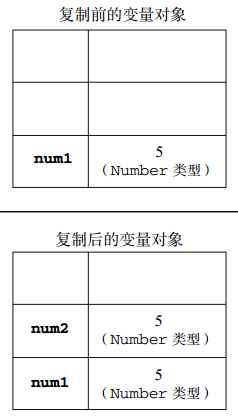
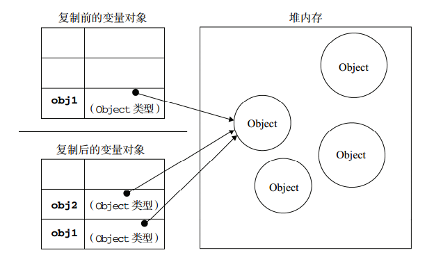

# 工厂模式 ：封装函数
> 对象的引用

    var a = 1;
    var b = a;
    b+=3;
    alert(b) //4
基本类型赋值时只是值得复制

    var a = [1,2,3];
    var b = a;
    b.push(4);
    alert(b) //[1,2,3,4]
    alert(a) //[1,2,3,4]
对象类型：赋值不仅是值的复制，而且也是引用的传递

    var a = [1,2,3];
    var b = a;
    b = [1,2,3,4] //程序中出现赋值，内存中重新生成一个值，a和b之间也就没有关系了
    alert(b) //[1,2,3,4]
    alert(a) //[1,2,3]

* 比较

1.基本类型

    var a = 1;
    var b = 1;
    alert(a === b)//true

只是值的比较

2.引用类型

    var a = [1,2,3];
    var b = [1,2,3];
    alert(a == b);//false;

值和引用都相同才相等(见下面代码)

    var a = [1,2,3];
    var b = a;
    alert(a == b)//true;

[相关知识](http://segmentfault.com/a/1190000002789651)
>原型

去改写对象下面公用的方法或属性，让公用的方法或者属性在内存中存在一份（提高性能）
原型：css中的class
普通方法：css中的style

|区别    |普通方法    |原型    |
| ------ |:----------:|-------:|
|优先级  |高          |低      |
|复用性  |不可复用    |可复用  |

运用原型：prototype要卸载构造函数下面
例子：[优先级](./demo5.html);
例子：[原型方法](./demo4.html);
写法总结：
如果是公用的就写到原型里，如果是变化的就写到构造函数里
例如：属性如果是变化的

    function构造函数(){
        this.属性
    }
    var 对象 = new 构造函数();
    对象.方法();
