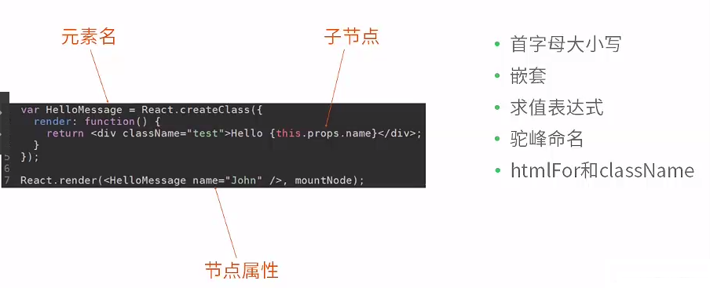

#JSX
- 1什么是JSX
    JSX = javaScript XML
    基于ECMAscript的一个特性
        —1.1 特点：
                    类XML语句荣誉接受
                    增强语义
                    结构清晰
                    抽象程度高
                    代码模块化
- 2语法
    